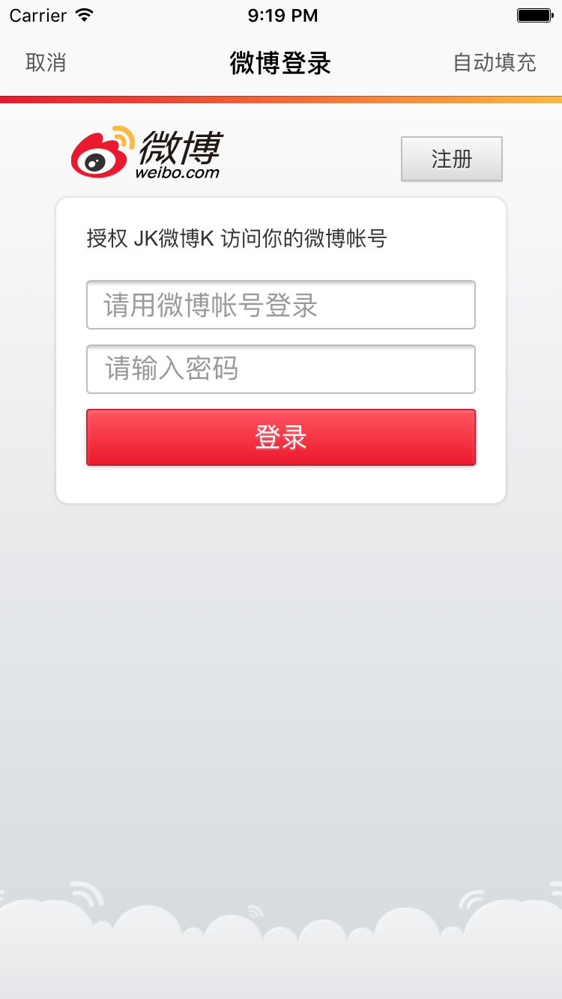
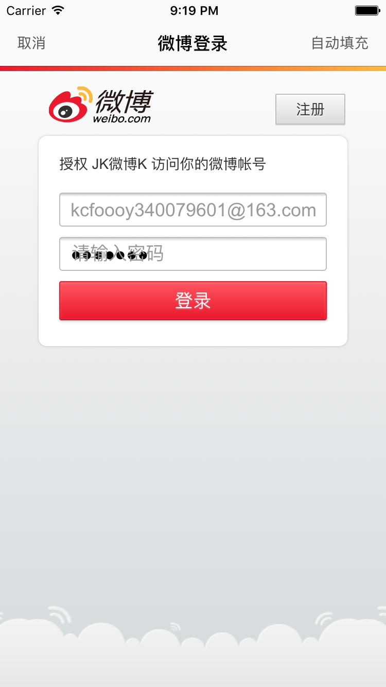

#JK_OAuth使用说明

## 使用前说明
1> 使用前，请确保控制器拥有一个导航控制器
2> 出于账号安全保护，在此，我没有给出测试账号。请您在使用LSOAuth前先拥有一个微博开发者账号，并在通用工具类`CommonTools`中设置好APPKEY、回调页、微博账号密码等信息。

## 其他
为什么使用OAuth授权登录？

- 没有token 就没办法访问微博的公共接口
- 使用微博登录  微博用户名 和 密码
- 登录 -> 授权
- 会给我们 app 一个 用户对应的 code(授权码)
- 新浪微博 特殊提供一个接口 只要你传入`code` 我就会给你对应这个人的 token
- 你通过新浪微博给你的token 拼接对应微博请求个人信息的数据借口就可以拿到用户对应的用户信息(name img age sex...)
- 这样我们 app 中 就有了用户的 name img age sex token

## 效果图






## 使用前配置
手动配置信息：
在CommonTools中手动配置相关信息

1. 微博API请求相关信息

* let LSAPPKEY = " "
* let LSAPPSECRET = " "
* let LSREDIRECTURI = " "

2. 微博账号和密码

* let LSWBNAME = " "
* let LSWBPASSWD = " "

## 使用说明
跳转到主控制即可完成OAuth授权
主控制器：LSOAuthViewController

1. 使用Modal或者push跳转到主控制器
2. 使用ib或者代码的方式加上导航控制器，可以使用下面的方法

```
将控制器作为导航控制器的根控制器
let oauthVc = LSOAuthViewController()
let oauthNavC = UINavigationController(rootViewController: oauthVc)

func setNav() -> Void {
        navigationItem.leftBarButtonItem = UIBarButtonItem(setHighlightedImgName: nil, title: "注册", target: self, action: #selector(loginClick))
        navigationItem.rightBarButtonItem = UIBarButtonItem(setHighlightedImgName: nil, title: "登录", target: self, action: #selector(loginClick))
    }
```

##第三方框架依赖

```
use_frameworks!
# 网络框架
pod 'AFNetworking'
# 加载指示器
pod 'SVProgressHUD'
# 网络图片加载
pod 'SDWebImage'
# YYModel
pod 'YYModel'
```

## 框架逻辑
使用MVVM的设计逻辑viewModel主要请求网络数据

1. webView作为主控制器的根式图
2. 发送request请求
3. 通过webView的代理方法监听webView将要加载的request
    - 得到code
4. 发送含有code等参数的请求获取token
    - 得到token等信息
    - 转为模型
5. 发送含有token&uid参数的请求获取公共微博接口数据
    - 转换成模型
    - NSKeyedArchiver归档入沙盒缓存模型
    
###版本信息
v1.0
